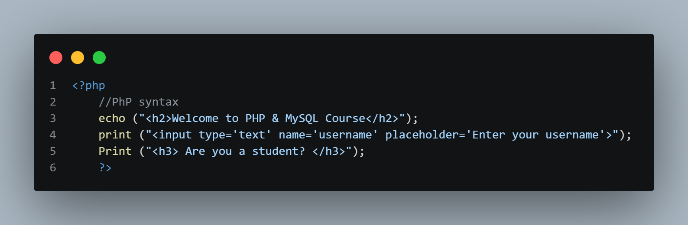
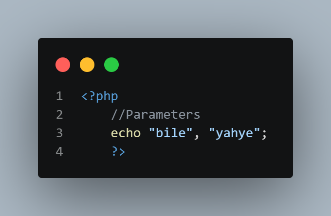
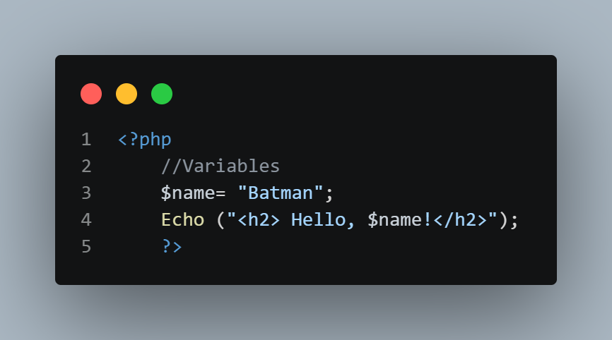
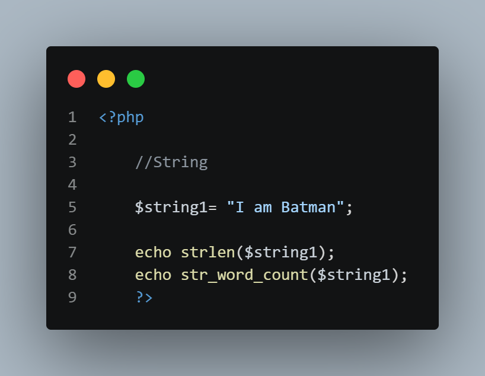
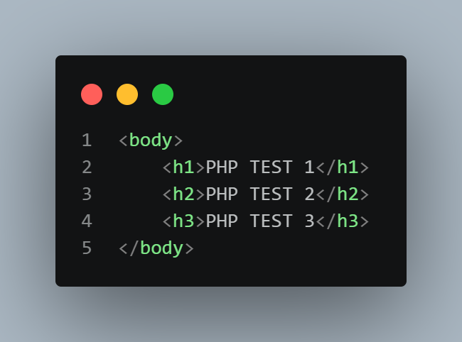

# Week 1 — Screenshots

## Overview

This README documents the screenshots inside the **Week 1 / Screenshot** folder for the **PHP & MySQL Course (CA233)**. Each screenshot captures a specific section of code from `index.php` or `test.html`, isolating one concept at a time for review.

The screenshots are numbered and named to reflect the order the concepts appear in `index.php`, followed by the Apache server sanity check performed with `test.html`.

| # | Filename | Section Documented |
|---|---|---|
| 1 | `01-php-syntax.png` | Basic PHP syntax and output statements |
| 2 | `02-php-parameters.png` | The `//Parameters` section |
| 3 | `03-php-variables.png` | The `//Variables` section |
| 4 | `04-php-strings.png` | The `//String` section |
| 5 | `05-html-server-test.png` | `test.html` — Apache server sanity check |

---

## 1. `01-php-syntax.png` — PHP Syntax

**What this screenshot shows:** the opening portion of the embedded PHP block in `index.php`, covering the transition from HTML into PHP and the basic output statements used before parameters, variables, or strings are introduced.



**Concepts demonstrated:**

- **Entering PHP mode:** The `<?php` tag switches the parser from HTML into PHP, allowing PHP statements to be embedded directly inside the HTML document body.
- **`echo` statement:** Used to output the `<h2>Welcome to PHP & MySQL Course</h2>` heading. `echo` is a language construct (not a true function), which is why it can be used with or without parentheses.
- **`print` statement:** Used twice — once to output an `<input>` element with `type`, `name`, and `placeholder` attributes, and once to output an `<h3>` heading. Like `echo`, `print` outputs a string to the browser, though it always returns a value of `1`.
- **Case-insensitivity of keywords:** `Print` (capitalized) is used alongside `print` (lowercase) in the same file. PHP keywords are case-insensitive, so both execute identically — though mixing case like this is inconsistent style rather than a functional necessity.

---

## 2. `02-php-parameters.png` — PHP Parameters

**What this screenshot shows:** the `//Parameters` section of `index.php`, where `echo` is called with more than one argument.



**Concepts demonstrated:**

- **Multiple parameters with `echo`:** `echo` can accept multiple comma-separated string arguments — here, `"bile"` and `"yahye"` — in a single statement.
- **Output order and spacing:** Each argument is printed immediately after the previous one, with no automatic space or separator inserted between them, so the output appears as `bileyahye`.
- **`echo` vs. functions with formal parameters:** This section is distinct from a user-defined function's parameters — `echo` is a language construct that simply accepts a comma-separated list of expressions to output, not a function with a defined parameter signature.

---

## 3. `03-php-variables.png` — PHP Variables

**What this screenshot shows:** the `//Variables` section of `index.php`, where a variable is declared and then used inside an output statement.



**Concepts demonstrated:**

- **Variable declaration:** `$name= "Batman";` declares a variable named `name`. In PHP, all variables are prefixed with a dollar sign (`$`), and this variable is assigned the string value `"Batman"` using the assignment operator (`=`).
- **Dynamic typing:** No type is declared for `$name` — PHP infers that it holds a string based on the assigned value, consistent with PHP's dynamically typed nature.
- **Variable interpolation:** Inside `Echo ("<h2> Hello, $name!</h2>");`, the variable `$name` is placed directly within a double-quoted string. PHP automatically substitutes the variable's value (`Batman`) into the string at that position, producing the output `Hello, Batman!` inside an `<h2>` tag. This works because double-quoted strings support variable parsing, unlike single-quoted strings.
- **Reusing prior syntax:** This section reuses the `Echo` construct introduced earlier (again capitalized), reinforcing that variables can be combined directly with the output statements already covered.

---

## 4. `04-php-strings.png` — PHP Strings

**What this screenshot shows:** the `//String` section of `index.php`, where a string variable is declared and then passed into two built-in string functions.



**Concepts demonstrated:**

- **String variable declaration:** `$string1= "I am Batman";` declares a variable holding the string value `"I am Batman"`, following the same assignment pattern used for `$name` in the variables section.
- **`strlen()` function:** `echo strlen($string1);` calculates and outputs the total number of characters in `$string1`, including letters and spaces. For `"I am Batman"`, this returns `11`.
- **`str_word_count()` function:** `echo str_word_count($string1);` counts and outputs the number of words in `$string1`. For `"I am Batman"`, this returns `3`.
- **Passing variables into built-in functions:** Both function calls demonstrate how a previously declared string variable can be passed as an argument to PHP's built-in string functions, and how the return value of each function can be output directly with `echo`.

---

## 5. `05-html-server-test.png` — Apache Server Test

**What this screenshot shows:** `test.html`, a separate static file used to verify the local Apache server setup before any PHP code was tested.



**Why `test.html` was used:**

Before testing any PHP code, `test.html` was created inside `C:\xampp\htdocs\test` to confirm that the Apache web server was correctly installed, running, and able to serve files from the `htdocs` directory — without involving PHP yet.

A plain HTML file was used for this first check because HTML requires no server-side processing; a browser can render it directly. Successfully loading `test.html` at `http://localhost/test/test.html` confirmed three things:

1. Apache was running and listening on port 80
2. The `htdocs\test` folder was correctly recognized as part of the server's document root
3. Requests to `localhost` were being routed to the correct file on disk

This isolated the test to the web server alone, without also involving the PHP interpreter. Only after confirming Apache worked correctly with this static file did testing move on to `index.php`, which requires both Apache and PHP working together — Apache to receive the request, and PHP to execute the code and generate output.

**In short:** `test.html` served as a baseline sanity check, proving the server setup itself worked, before adding the extra layer of PHP into the test.

---

## Screenshot Folder Structure

```
Week 1/
└── Screenshot/
    ├── 01-php-syntax.png
    ├── 02-php-parameters.png
    ├── 03-php-variables.png
    ├── 04-php-strings.png
    └── 05-html-server-test.png
```

Each image above corresponds to the matching numbered section in this README. The source files they were captured from (`index.php` and `test.html`) live in the parent `Week 1` folder and are documented separately in that folder's own `README.md`.
