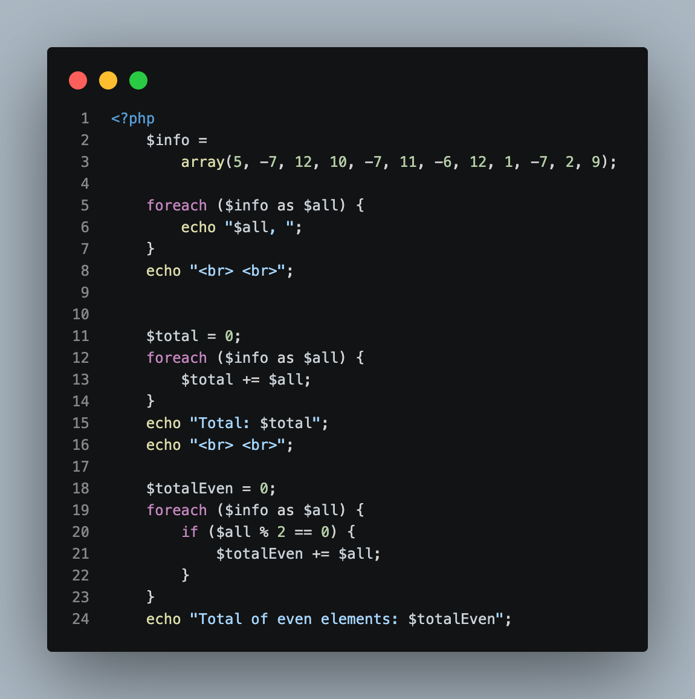
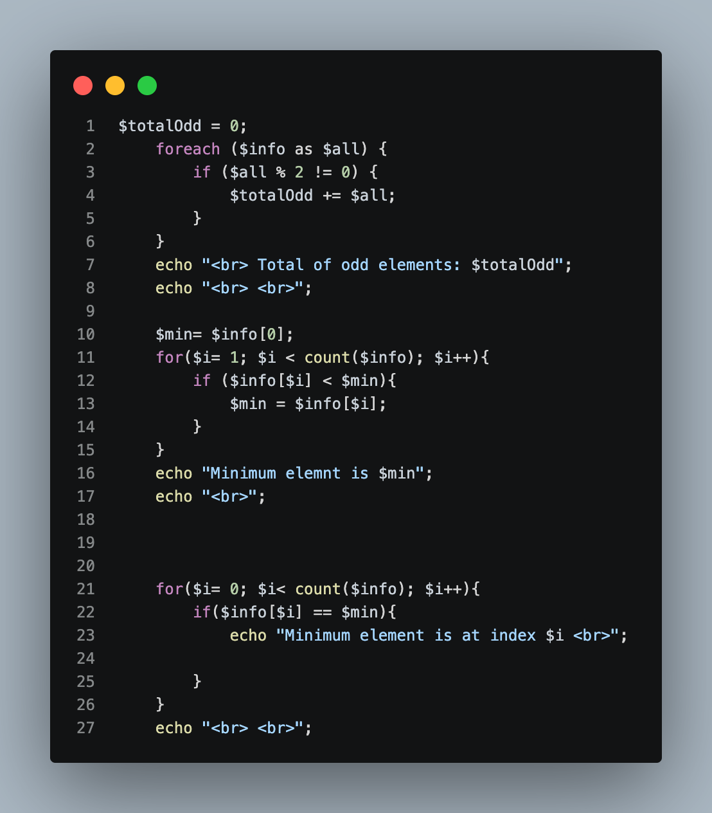
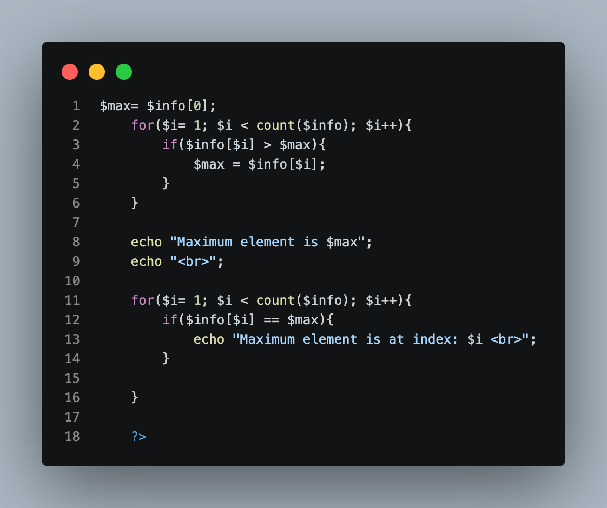
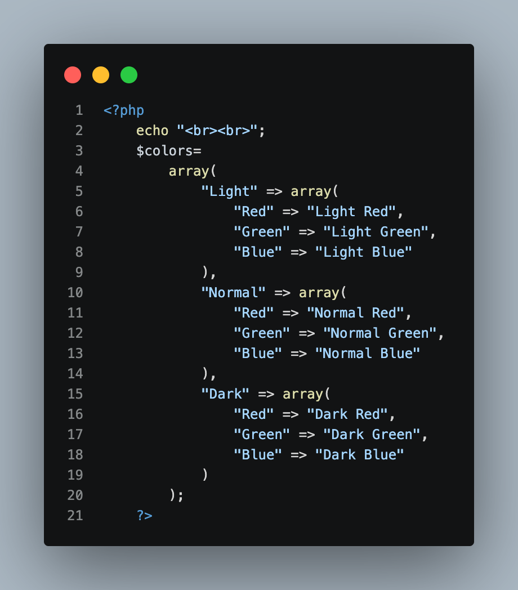
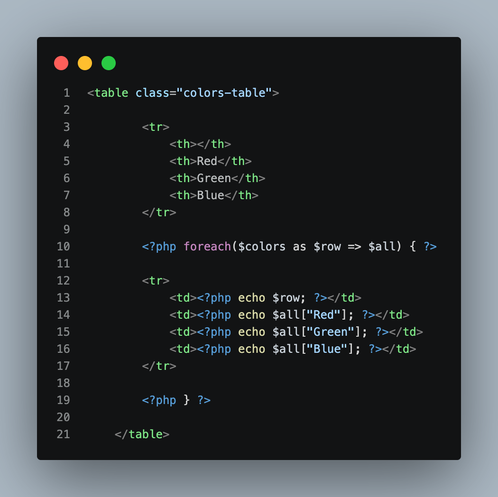
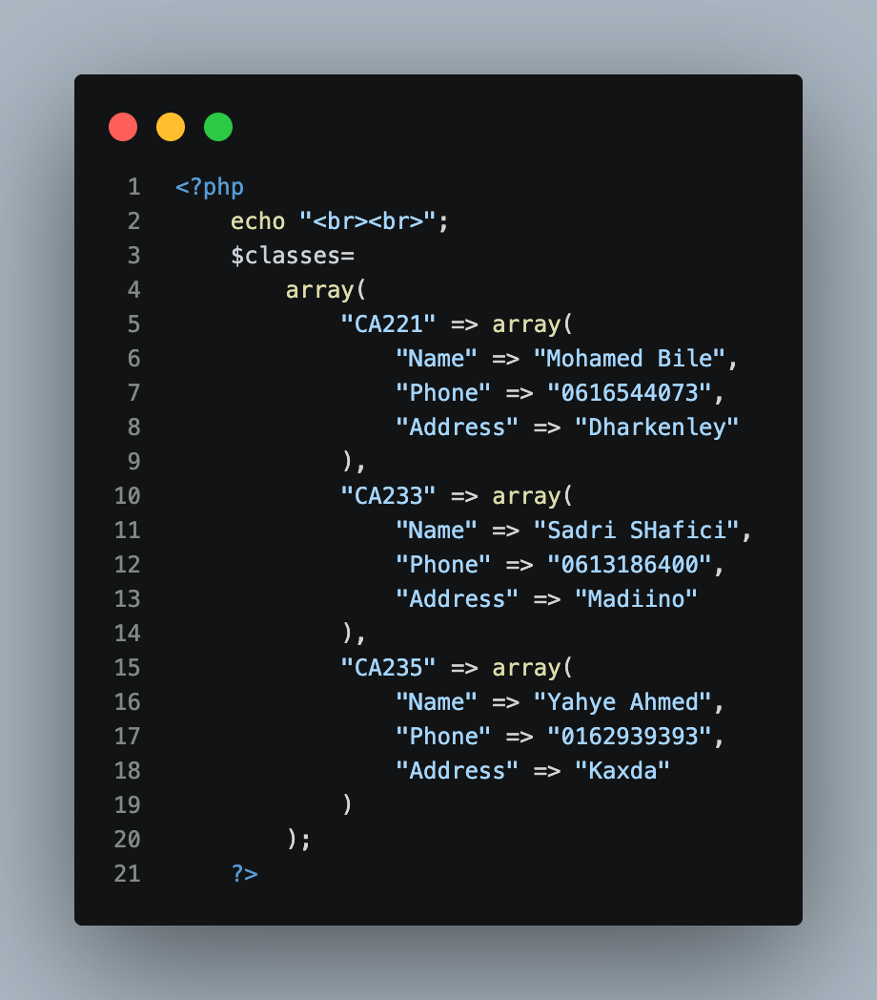
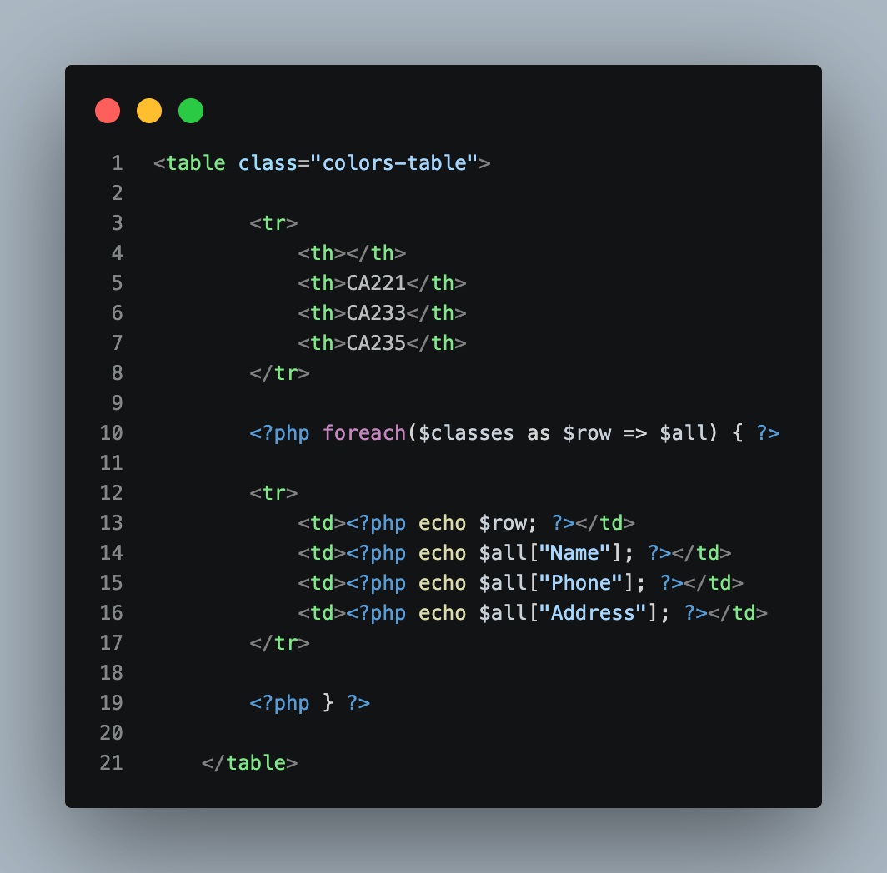

# Week 4 — Screenshots

## Overview

This README documents the screenshots inside the **Week 4 / Screenshots** folder for the **PHP & MySQL Course (CA233)**. Each screenshot captures a specific section of code from `Asiignments.php`, isolating one part of the **Chapter 3 Assignment (Arrays)** at a time for review.

The screenshots are numbered and named to reflect the order the questions appear in the assignment: a one-dimensional array with totals, minimum and maximum (Question 1), a two-dimensional associative array of colors (Question 2), and a two-dimensional associative array of class information (Question 3).

| # | Filename | Section Documented |
|---|---|---|
| 1 | `code1.png` | Question 1 (Parts 1–4): declaring the array, printing its elements, total of all elements, total of even elements |
| 2 | `code2.png` | Question 1 (Parts 5–6): total of odd elements, minimum element and its positions |
| 3 | `code3.png` | Question 1 (Part 7): maximum element and its positions |
| 4 | `code6.png` | Question 2: declaring the two-dimensional colors array |
| 5 | `code7.png` | Question 2: printing the colors array as an HTML table |
| 6 | `code8.png` | Question 3: declaring the two-dimensional classes array |
| 7 | `code9.png` | Question 3: printing the classes array as an HTML table |

---

## 1. `code1.png` — Question 1 (Parts 1–4): Array, Print, Total, Total of Even



**What this screenshot shows:** the opening section of `Asiignments.php`, where the one-dimensional array is declared, all of its elements are printed, and the total of all elements and the total of the even elements are calculated.

```php
<?php
$info =
    array(5, -7, 12, 10, -7, 11, -6, 12, 1, -7, 2, 9);

foreach ($info as $all) {
    echo "$all, ";
}
echo "<br> <br>";


$total = 0;
foreach ($info as $all) {
    $total += $all;
}
echo "Total: $total";
echo "<br> <br>";

$totalEven = 0;
foreach ($info as $all) {
    if ($all % 2 == 0) {
        $totalEven += $all;
    }
}
echo "Total of even elements: $totalEven";
```

**Concepts demonstrated:**

- **One-dimensional array:** `$info` is declared with `array(...)` and initialized with the twelve values given in the assignment, including negative numbers.
- **`foreach` loop:** `foreach ($info as $all)` visits every element of the array in order, and is reused for printing, summing, and filtering.
- **Accumulator variables:** `$total` and `$totalEven` both start at `0`, and `+=` adds each qualifying element to them as the loop runs.
- **Modulus operator (`%`):** `$all % 2 == 0` filters for even elements so that only they are added to `$totalEven`.
- **Inline string interpolation:** `"$all, "` and `"Total: $total"` embed the variables directly inside the strings.
- **Result for this example:** The array prints as `5, -7, 12, 10, -7, 11, -6, 12, 1, -7, 2, 9,`, the total of all elements is `35`, and the total of the even elements (`12`, `10`, `-6`, `12`, `2`) is `30`.

---

## 2. `code2.png` — Question 1 (Parts 5–6): Total of Odd Elements, Minimum and Its Positions



**What this screenshot shows:** the total of the odd elements, followed by finding the minimum element and printing every position where it appears.

```php
$totalOdd = 0;
foreach ($info as $all) {
    if ($all % 2 != 0) {
        $totalOdd += $all;
    }
}
echo "<br> Total of odd elements: $totalOdd";
echo "<br> <br>";

$min= $info[0];
for($i= 1; $i < count($info); $i++){
    if ($info[$i] < $min){
        $min = $info[$i];
    }
}
echo "Minimum elemnt is $min";
echo "<br>";


for($i= 0; $i< count($info); $i++){
    if($info[$i] == $min){
        echo "Minimum element is at index $i <br>";

    }
}
echo "<br> <br>";
```

**Concepts demonstrated:**

- **Odd-element total:** `$all % 2 != 0` filters for odd elements, and `$totalOdd` accumulates them with `+=`, the same pattern used for the even total.
- **Finding the minimum:** `$min` starts as the first element (`$info[0]`), and a `for` loop from index `1` replaces `$min` whenever a smaller element is found.
- **`count()` function:** `$i < count($info)` lets the loops run across the whole array without hard-coding its length.
- **Finding all positions:** A second `for` loop starting at index `0` compares every element with `$min` and prints the index `$i` each time they are equal, so a value that appears more than once is reported at every position.
- **Result for this example:** The total of the odd elements (`5`, `-7`, `-7`, `11`, `1`, `-7`, `9`) is `5`. The minimum element is `-7`, found at indexes `1`, `4`, and `9`.

---

## 3. `code3.png` — Question 1 (Part 7): Maximum and Its Positions



**What this screenshot shows:** finding the maximum element of the array and printing the positions where it appears, followed by the closing `?>` tag of the first PHP block.

```php
$max= $info[0];
for($i= 1; $i < count($info); $i++){
    if($info[$i] > $max){
        $max = $info[$i];
    }
}

echo "Maximum element is $max";
echo "<br>";

for($i= 1; $i < count($info); $i++){
    if($info[$i] == $max){
        echo "Maximum element is at index: $i <br>";
    }

}

?>
```

**Concepts demonstrated:**

- **Finding the maximum:** `$max` starts as the first element (`$info[0]`), and a `for` loop from index `1` replaces `$max` whenever a larger element is found — the same pattern as the minimum, with `>` in place of `<`.
- **Printing positions:** A second `for` loop, starting at index `1`, prints the index `$i` each time `$info[$i] == $max`.
- **Closing the PHP block:** `?>` ends the PHP section, after which the file returns to HTML for the tables in Questions 2 and 3.
- **Result for this example:** The maximum element is `12`, found at indexes `2` and `7`.

---

## 4. `code6.png` — Question 2: The Colors Array



**What this screenshot shows:** the two-dimensional associative array for Question 2, where the row names are `Light`, `Normal`, and `Dark` and the column names are `Red`, `Green`, and `Blue`.

```php
<?php
echo "<br><br>";
$colors=
    array(
        "Light" => array(
            "Red" => "Light Red",
            "Green" => "Light Green",
            "Blue" => "Light Blue"
        ),
        "Normal" => array(
            "Red" => "Normal Red",
            "Green" => "Normal Green",
            "Blue" => "Normal Blue"
        ),
        "Dark" => array(
            "Red" => "Dark Red",
            "Green" => "Dark Green",
            "Blue" => "Dark Blue"
        )
    );
?>
```

**Concepts demonstrated:**

- **Associative array:** Each element is accessed by a named key (`"Light"`, `"Red"`, ...) using the `=>` operator instead of a numeric index.
- **Two-dimensional array:** The outer array's keys are the row names (`Light`, `Normal`, `Dark`), and each value is an inner array whose keys are the column names (`Red`, `Green`, `Blue`).
- **Matching the assignment table:** Each element holds the text shown in the assignment's table, for example `"Light" => "Red" => "Light Red"`.
- **Spacing with `echo`:** `echo "<br><br>";` adds blank lines before the table that is printed from this array.

---

## 5. `code7.png` — Question 2: Printing the Colors Table



**What this screenshot shows:** the HTML table that prints the colors array, with a header row for the column names and one row per row name.

```php
<table class="colors-table">

    <tr>
        <th></th>
        <th>Red</th>
        <th>Green</th>
        <th>Blue</th>
    </tr>

    <?php foreach($colors as $row => $all) { ?>

    <tr>
        <td><?php echo $row; ?></td>
        <td><?php echo $all["Red"]; ?></td>
        <td><?php echo $all["Green"]; ?></td>
        <td><?php echo $all["Blue"]; ?></td>
    </tr>

    <?php } ?>

</table>
```

**Concepts demonstrated:**

- **PHP inside HTML:** The table is written in plain HTML, and PHP is opened with `<?php ... ?>` only where dynamic values are needed.
- **`foreach` with keys and values:** `foreach($colors as $row => $all)` gives the row name in `$row` (`Light`, `Normal`, `Dark`) and the inner array in `$all` on each pass.
- **Accessing inner array values:** `$all["Red"]`, `$all["Green"]`, and `$all["Blue"]` read the three column values of the current row.
- **Loop spanning HTML:** The `foreach` opens before the `<tr>` and its closing brace `<?php } ?>` comes after `</tr>`, so one table row is generated per row name.
- **Table structure:** The first `<th>` is empty (the corner cell), followed by the `Red`, `Green`, and `Blue` headers, and the table uses the `colors-table` class.

---

## 6. `code8.png` — Question 3: The Classes Array



**What this screenshot shows:** the two-dimensional associative array for Question 3, where the row names are class codes and the column names are `Name`, `Phone`, and `Address`.

```php
<?php
echo "<br><br>";
$classes=
    array(
        "CA221" => array(
            "Name" => "Mohamed Bile",
            "Phone" => "0616544073",
            "Address" => "Dharkenley"
        ),
        "CA233" => array(
            "Name" => "Sadri SHafici",
            "Phone" => "0613186400",
            "Address" => "Madiino"
        ),
        "CA235" => array(
            "Name" => "Yahye Ahmed",
            "Phone" => "0162939393",
            "Address" => "Kaxda"
        )
    );
?>
```

**Concepts demonstrated:**

- **Associative array with class codes as row keys:** The outer keys are `"CA221"`, `"CA233"`, and `"CA235"`.
- **Inner arrays with named columns:** Each class code holds an inner array with the keys `"Name"`, `"Phone"`, and `"Address"`.
- **Phone numbers as strings:** The phone numbers are written in quotes, so they are stored as strings and the leading `0` is kept.
- **Same structure as Question 2:** The array is built the same way as `$colors`, with a different set of row names, column names, and values.

---

## 7. `code9.png` — Question 3: Printing the Classes Table



**What this screenshot shows:** the HTML table that prints the classes array using a `foreach` loop.

```php
<table class="colors-table">

    <tr>
        <th></th>
        <th>CA221</th>
        <th>CA233</th>
        <th>CA235</th>
    </tr>

    <?php foreach($classes as $row => $all) { ?>

    <tr>
        <td><?php echo $row; ?></td>
        <td><?php echo $all["Name"]; ?></td>
        <td><?php echo $all["Phone"]; ?></td>
        <td><?php echo $all["Address"]; ?></td>
    </tr>

    <?php } ?>

</table>
```

**Concepts demonstrated:**

- **`foreach` with keys and values:** `foreach($classes as $row => $all)` puts the class code in `$row` and the inner array in `$all` on each pass.
- **Accessing inner array values:** `$all["Name"]`, `$all["Phone"]`, and `$all["Address"]` read the three values stored for the current class code.
- **One table row per class code:** Each pass of the loop prints one `<tr>`, with `$row` in the first cell followed by the Name, Phone, and Address cells.
- **Header row:** The header contains an empty corner cell followed by `CA221`, `CA233`, and `CA235`.
- **Reused CSS class:** The table uses the same `colors-table` class as the Question 2 table.

---

## Screenshot Folder Structure

```
Week 4/
└── Screenshots/
    ├── code1.png
    ├── code2.png
    ├── code3.png
    ├── code6.png
    ├── code7.png
    ├── code8.png
    ├── code9.png
    └── README.md
```

Each image above corresponds to the matching numbered section in this README. The source file they were captured from (`Asiignments.php`) lives in the parent `Week 4` folder.
