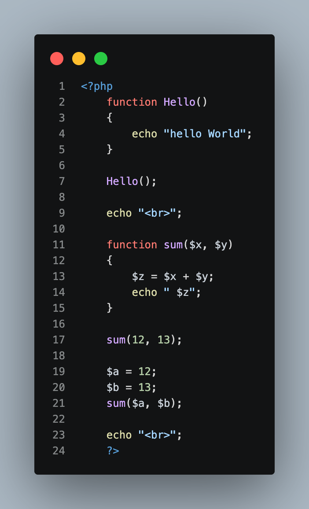
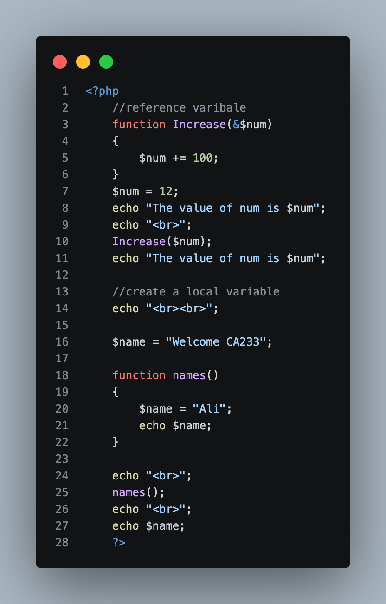
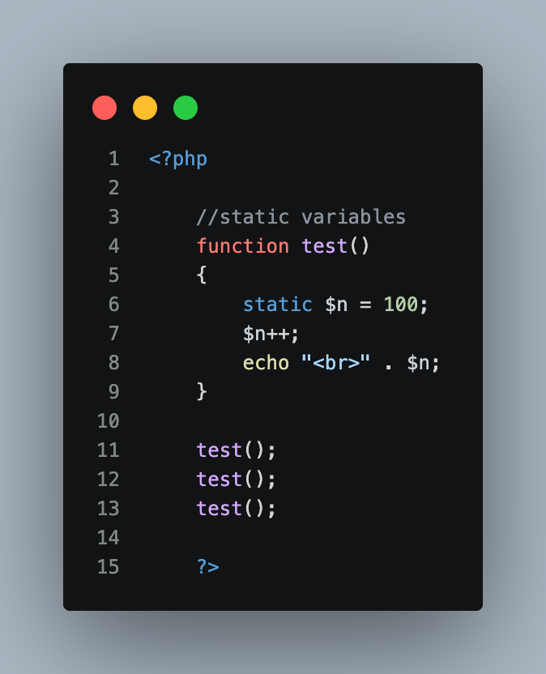
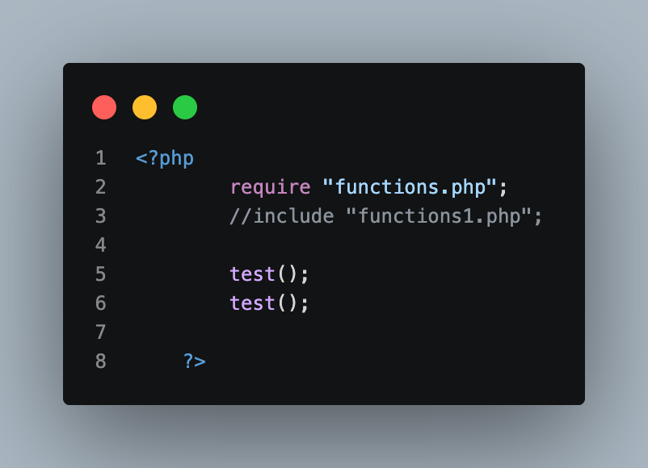
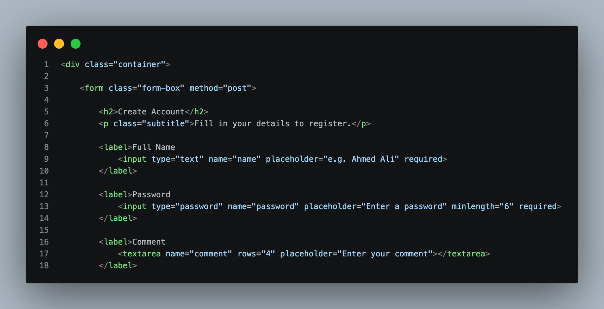
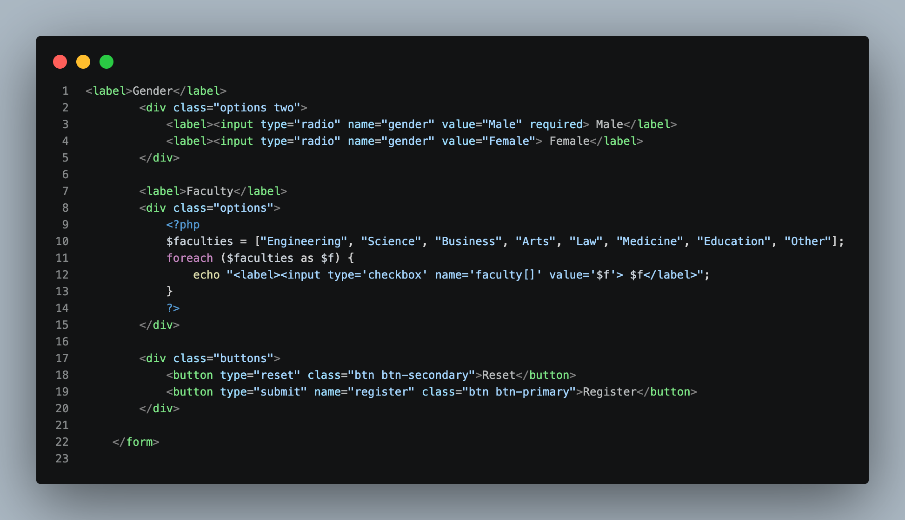
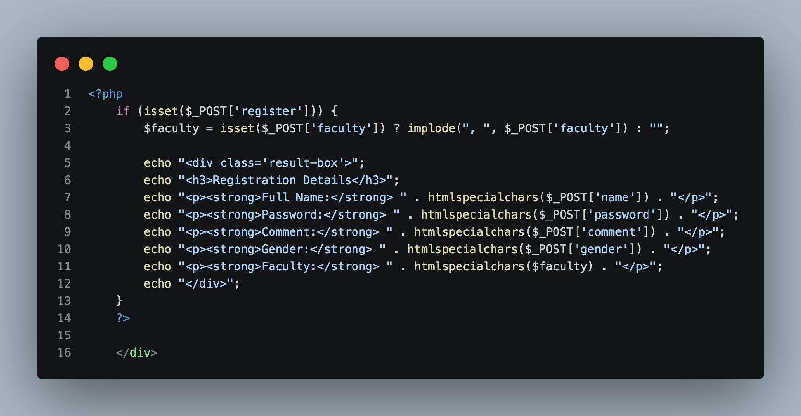

# Week 5 — Screenshots

## Overview

This README documents the screenshots inside the **Week 5 / Screenshots** folder for the **PHP & MySQL Course (CA233)**. Each screenshot captures one section of code from the Week 5 labs, and each section below explains **what the code does and the theory behind it**.

Week 5 has two parts:

- **Day 1 — Functions and file inclusion** (`functions.php`, `include.php`): how to write reusable functions, how data is passed to them, how variable scope works, how a `static` variable remembers its value, and how one PHP file can load another.
- **Day 2 — Lab 1: Registration form** (`lab1.php`): how an HTML form sends data to PHP using `POST`, how checkboxes are generated with a loop, and how PHP reads, cleans, and displays the submitted data.

| # | Filename | Source File | Section Documented |
|---|---|---|---|
| 1 | `Img1.png` | `functions.php` | Declaring and calling functions, parameters and arguments |
| 2 | `Img2.png` | `functions.php` | Passing by reference, local and global variables |
| 3 | `Img3.png` | `functions.php` | Static variables |
| 4 | `Img4.png` | `include.php` | `require` and `include` |
| 5 | `Img5.png` | `lab1.php` | Form start: `<form>`, text, password and textarea fields |
| 6 | `Img6.png` | `lab1.php` | Radio buttons, checkboxes generated by a loop, form buttons |
| 7 | `Img7.png` | `lab1.php` | Reading `$_POST` and displaying the registration result |

---

# Day 1 — Functions and File Inclusion

## 1. `Img1.png` — Declaring and Calling Functions



**What this screenshot shows:** two simple functions. `Hello()` prints a message, and `sum()` adds two numbers and prints the result. Both are then called.

```php
<?php
    function Hello()
    {
        echo "hello World";
    }

    Hello();

    echo "<br>";

    function sum($x, $y)
    {
        $z = $x + $y;
        echo " $z";
    }

    sum(12, 13);

    $a = 12;
    $b = 13;
    sum($a, $b);

    echo "<br>";
    ?>
```

**Theory — what is a function?**

A function is a named block of code that performs one task. You write it once and use it as many times as you need. This avoids repeating code and makes a program easier to read and fix.

A function has two separate steps:

| Step | Syntax | What happens |
|---|---|---|
| **Declaring** (defining) | `function Hello() { ... }` | PHP learns the function exists. Nothing is executed yet. |
| **Calling** | `Hello();` | PHP runs the code inside the function. |

**Theory — parameters and arguments**

- **Parameters** are the placeholders in the declaration: `$x` and `$y` in `function sum($x, $y)`.
- **Arguments** are the real values given when calling: `12` and `13` in `sum(12, 13)`.
- An argument can be a direct value (`sum(12, 13)`) or a variable (`sum($a, $b)`). In both cases, the function works with the values.

**Theory — pass by value**

By default, PHP passes a **copy** of the value to the function. If `sum()` changed `$x` inside, the original `$a` would stay the same. The next screenshot shows how to change this behavior.

**Concepts demonstrated:**

- **Function without parameters:** `Hello()` needs no input and always does the same thing.
- **Function with parameters:** `sum($x, $y)` gives a different result depending on the values it receives.
- **Local variable `$z`:** it is created inside `sum()` to store the result and exists only while the function runs.
- **Line breaks:** `echo "<br>";` moves the output to a new line in the browser.
- **Naming:** function names are **not** case-sensitive in PHP (`Hello()` and `hello()` are the same), but variable names **are** (`$a` and `$A` are different).

**Result for this example:**

```
hello World
 25 25
```

> **Note:** `sum()` prints its result with `echo`. Functions can also **return** a value with the `return` keyword, so the caller decides what to do with it. Printing is fine for learning the basics.

---

## 2. `Img2.png` — Pass by Reference and Variable Scope



**What this screenshot shows:** a function that changes the original variable using a reference, and a demonstration that a variable created inside a function is separate from one with the same name outside.

```php
<?php
    //reference varibale
    function Increase(&$num)
    {
        $num += 100;
    }
    $num = 12;
    echo "The value of num is $num";
    echo "<br>";
    Increase($num);
    echo "The value of num is $num";

    //create a local variable
    echo "<br><br>";

    $name = "Welcome CA233";

    function names()
    {
        $name = "Ali";
        echo $name;
    }

    echo "<br>";
    names();
    echo "<br>";
    echo $name;
    ?>
```

**Theory — pass by reference**

The `&` symbol before a parameter (`&$num`) tells PHP **not to copy** the value. Instead, the parameter becomes another name for the original variable. Anything done to `$num` inside the function changes the variable outside as well.

| | Pass by value | Pass by reference |
|---|---|---|
| Syntax | `function Increase($num)` | `function Increase(&$num)` |
| What the function receives | A copy | The original variable |
| Effect on the original | None | The original changes |

Here, `$num` starts as `12`. After `Increase($num)`, it becomes `112`, because `$num += 100` is the same as `$num = $num + 100`, and it was applied to the original variable.

**Theory — variable scope**

**Scope** is the part of a program where a variable can be used.

- A variable created **outside** any function is a **global** variable. It is not visible inside functions automatically.
- A variable created **inside** a function is a **local** variable. It exists only while the function runs and disappears when the function ends.

In this example there are **two different variables** called `$name`:

| Variable | Where it lives | Value |
|---|---|---|
| Global `$name` | Outside the function | `"Welcome CA233"` |
| Local `$name` | Inside `names()` | `"Ali"` |

Calling `names()` prints `Ali`, but it does **not** change the global `$name`, so the last `echo $name;` still prints `Welcome CA233`.

> To use a global variable inside a function on purpose, PHP provides the `global` keyword (`global $name;`). This example intentionally does not use it, to show that scopes are separate.

**Concepts demonstrated:**

- **Reference parameter:** `&$num` lets a function modify the caller's variable.
- **Compound assignment:** `+=` adds a value to a variable and stores the result back.
- **Local scope:** the `$name` inside `names()` never affects the outer `$name`.
- **Global scope:** the outer `$name` keeps its own value.

**Result for this example:**

```
The value of num is 12
The value of num is 112

Ali
Welcome CA233
```

---

## 3. `Img3.png` — Static Variables



**What this screenshot shows:** a function with a `static` variable that keeps its value between calls, and three calls to that function.

```php
<?php

    //static variables
    function test()
    {
        static $n = 100;
        $n++;
        echo "<br>" . $n;
    }

    test();
    test();
    test();

    ?>
```

**Theory — why static variables exist**

Normally, a local variable is created every time a function is called and destroyed when it ends. The function has **no memory** of previous calls.

A **`static`** variable changes this:

- It is **initialized only once**, on the first call. Here, `$n = 100` is executed only the first time.
- It **keeps its value** after the function ends, so the next call continues from where the last one stopped.
- It is still **local**. It cannot be used outside the function.

**Step by step:**

| Call | `$n` before | `$n++` | Printed |
|---|---|---|---|
| 1st `test()` | `100` (initialized) | `101` | `101` |
| 2nd `test()` | `101` (remembered) | `102` | `102` |
| 3rd `test()` | `102` (remembered) | `103` | `103` |

Without the word `static`, every call would start from `100` and print `101` each time.

**Concepts demonstrated:**

- **`static` keyword:** keeps a local variable's value between function calls.
- **Increment operator `++`:** adds `1` to the variable.
- **Concatenation operator `.`:** `"<br>" . $n` joins the line break and the number into one output.
- **Typical use:** counters, such as counting how many times a function was called.

> A static variable lasts only for **one run of the script**. When the page is loaded again, it starts from `100` again.

---

## 4. `Img4.png` — `require` and `include`



**What this screenshot shows:** `include.php` loads `functions.php` with `require`, then calls the `test()` function that is defined in that file.

```php
<?php
        require "functions.php";
        //include "functions1.php";

        test();
        test();

    ?>
```

**Theory — why include other files?**

As programs grow, putting all code in one file becomes hard to manage. PHP lets you split code into files and load them where needed. This gives:

- **Reuse:** one file (for example, a file of functions) can be used by many pages.
- **Organization:** each file has one clear purpose.
- **Easy maintenance:** a fix in one file applies everywhere it is loaded.

When PHP reaches `require "functions.php";`, it loads that file and runs it as if its content were written at that exact place. After that, the functions defined in it, like `test()`, can be called.

**Theory — `require` vs `include`**

Both load a file. The difference is what happens when the file **cannot be found**:

| Statement | If the file is missing | Use it for |
|---|---|---|
| `require` | **Fatal error.** The script stops. | Files the page cannot work without (functions, configuration) |
| `include` | **Warning.** The script continues. | Optional parts (a banner, an extra menu) |

There are also `require_once` and `include_once`. They load a file **only if it has not been loaded already**, which prevents errors such as "cannot redeclare function" when the same file is loaded twice.

The commented line `//include "functions1.php";` shows the alternative, `include`.

**Concepts demonstrated:**

- **File inclusion:** `require` makes the code of another file available.
- **Calling functions from another file:** `test()` works in `include.php` even though it is defined in `functions.php`.
- **Static variable across calls:** the counter from `Img3` keeps counting.

**Result for this example:**

`require` runs the **whole** `functions.php` file, not only its functions. In `functions.php`, `test()` is already called three times (`101`, `102`, `103`), so the two calls in `include.php` continue the same counter and print:

```
104
105
```

The other output produced by `functions.php` (from `Img1`, `Img2`, and `Img3`) also appears on the page before these two numbers.

> **Good practice:** a file that is meant to be loaded with `require` usually contains only function definitions, so that nothing is printed when it loads.

---

# Day 2 — Lab 1: Registration Form

## 5. `Img5.png` — Form Start: Text, Password, and Textarea Fields



**What this screenshot shows:** the opening part of the registration form: the container, the `<form>` tag, the title, and the first three fields (full name, password, comment).

```html
<div class="container">

    <form class="form-box" method="post">

        <h2>Create Account</h2>
        <p class="subtitle">Fill in your details to register.</p>

        <label>Full Name
            <input type="text" name="name" placeholder="e.g. Ahmed Ali" required>
        </label>

        <label>Password
            <input type="password" name="password" placeholder="Enter a password" minlength="6" required>
        </label>

        <label>Comment
            <textarea name="comment" rows="4" placeholder="Enter your comment"></textarea>
        </label>
```

**Theory — how a form talks to PHP**

An HTML form collects data from the user. When the user clicks submit, the browser sends the data to the server, and PHP receives it in a built-in array called **`$_POST`**.

The flow is:

```
User fills the form  →  clicks Register  →  browser sends the data (POST)
        →  PHP receives it in $_POST  →  PHP processes and displays it
```

**Theory — `method="post"`**

| | GET | POST |
|---|---|---|
| Where data is sent | In the URL | In the body of the request |
| Visible in the address bar | Yes | No |
| Typical use | Searching, filtering | Registration, login, forms that send or change data |

Because this form sends a password, it uses `POST`. The form has no `action` attribute, so it sends the data to **the same page**, which is why `lab1.php` both shows the form and handles it.

**Theory — the `name` attribute**

The `name` of each field becomes the **key** in `$_POST`. This is the link between the HTML and the PHP:

| HTML field | Read in PHP with |
|---|---|
| `name="name"` | `$_POST['name']` |
| `name="password"` | `$_POST['password']` |
| `name="comment"` | `$_POST['comment']` |

A field without a `name` is not sent at all.

**Theory — the `<label>` element**

Wrapping an input inside `<label>` connects the text to the field. Clicking the text focuses the field, which also helps screen readers. Because the input is inside the label, no `id` or `for` attributes are needed.

**Concepts demonstrated:**

- **`type="text"`:** a single-line text field.
- **`type="password"`:** hides the typed characters.
- **`<textarea>`:** a multi-line field. `rows="4"` sets its visible height.
- **`placeholder`:** a hint inside the empty field. It is not a real value.
- **`required`:** the browser refuses to submit the form if the field is empty.
- **`minlength="6"`:** the browser requires at least six characters in the password.

> **Important:** `required` and `minlength` are checked **in the browser only**, and a user can bypass them. A real application must validate the data again in PHP.

---

## 6. `Img6.png` — Radio Buttons, Checkboxes Generated by a Loop, and Buttons



**What this screenshot shows:** the gender radio buttons, the faculty checkboxes created by a PHP loop, the Reset and Register buttons, and the closing `</form>` tag.

```php
<label>Gender</label>
        <div class="options two">
            <label><input type="radio" name="gender" value="Male" required> Male</label>
            <label><input type="radio" name="gender" value="Female"> Female</label>
        </div>

        <label>Faculty</label>
        <div class="options">
            <?php
            $faculties = ["Engineering", "Science", "Business", "Arts", "Law", "Medicine", "Education", "Other"];
            foreach ($faculties as $f) {
                echo "<label><input type='checkbox' name='faculty[]' value='$f'> $f</label>";
            }
            ?>
        </div>

        <div class="buttons">
            <button type="reset" class="btn btn-secondary">Reset</button>
            <button type="submit" name="register" class="btn btn-primary">Register</button>
        </div>

    </form>
```

**Theory — radio buttons**

Radio buttons let the user choose **exactly one** option from a group.

- Radio buttons with the **same `name`** (`gender`) belong to one group, so selecting one deselects the other.
- Each button has its own `value` (`Male`, `Female`). Only the value of the selected button is sent.
- `required` on one button of the group makes the whole group mandatory.

**Theory — checkboxes**

Checkboxes let the user choose **zero, one, or many** options.

- The name is written as **`faculty[]`**. The square brackets tell PHP to collect all selected values into an **array**. Without them, PHP would keep only the last selected value.
- Checkboxes that are **not ticked are not sent at all**. This is why the PHP code in `Img7` must check whether `faculty` exists before using it.

**Theory — generating HTML with a loop**

Instead of writing eight checkbox lines by hand, the code stores the faculty names in an array and uses `foreach` to create one checkbox for each:

1. `$faculties` is an **indexed array** with eight values.
2. `foreach ($faculties as $f)` runs the loop body once per value, placing the current value in `$f`.
3. `echo` prints one `<label>` with a checkbox, using `$f` for both the `value` and the visible text.

Adding a new faculty only needs one more item in the array. In the `echo` string, double quotes `"..."` allow `$f` to be replaced by its value, and single quotes `'...'` are used for the HTML attributes so they do not end the string.

**Theory — the two buttons**

| Button | Type | Behavior |
|---|---|---|
| Reset | `type="reset"` | Clears the form in the browser. PHP is not involved. |
| Register | `type="submit"` | Sends the form to the server. |

The Register button has `name="register"`, so when it is used, `$_POST['register']` exists. PHP uses this to know that **the form was submitted** (see `Img7`).

**Concepts demonstrated:**

- **Radio group:** one choice, same `name`.
- **Checkbox array:** many choices, name ending with `[]`.
- **`foreach` loop with `echo`:** generates repeated HTML from an array.
- **PHP inside HTML:** `<?php ... ?>` is opened only where it is needed.
- **Submit detection:** the button's `name` lets PHP detect submission.

---

## 7. `Img7.png` — Reading `$_POST` and Displaying the Result



**What this screenshot shows:** the PHP code that runs after the form is submitted. It reads the submitted values, cleans them, and prints a "Registration Details" box. The last `</div>` closes the `container` opened in `Img5`.

```php
<?php
    if (isset($_POST['register'])) {
        $faculty = isset($_POST['faculty']) ? implode(", ", $_POST['faculty']) : "";

        echo "<div class='result-box'>";
        echo "<h3>Registration Details</h3>";
        echo "<p><strong>Full Name:</strong> " . htmlspecialchars($_POST['name']) . "</p>";
        echo "<p><strong>Password:</strong> " . htmlspecialchars($_POST['password']) . "</p>";
        echo "<p><strong>Comment:</strong> " . htmlspecialchars($_POST['comment']) . "</p>";
        echo "<p><strong>Gender:</strong> " . htmlspecialchars($_POST['gender']) . "</p>";
        echo "<p><strong>Faculty:</strong> " . htmlspecialchars($faculty) . "</p>";
        echo "</div>";
    }
    ?>

</div>
```

**Theory — the page has two states**

The same file shows the form and handles it, so PHP must know which situation it is in:

| State | `$_POST['register']` | What the page shows |
|---|---|---|
| First visit | Does not exist | Only the form |
| After clicking Register | Exists | The form and the result box |

`isset()` checks whether a variable exists and is not `null`. The `if (isset($_POST['register']))` block, therefore, runs only after the form was submitted.

**Theory — handling the faculty checkboxes**

```php
$faculty = isset($_POST['faculty']) ? implode(", ", $_POST['faculty']) : "";
```

This line has three ideas:

- **Ternary operator:** `condition ? value_if_true : value_if_false` is a short form of `if / else`.
- **`isset($_POST['faculty'])`:** if the user ticked nothing, `faculty` was never sent, so it must be checked first.
- **`implode(", ", array)`:** joins the elements of an array into one string. For example, `["Science", "Law"]` becomes `"Science, Law"`. If nothing was ticked, `$faculty` is an empty string.

**Theory — `htmlspecialchars()` and security**

Data typed by a user must **never be printed directly** into a page. If a user types `<script>...</script>` in the comment box, the browser could run it. This attack is called **Cross-Site Scripting (XSS)**.

`htmlspecialchars()` converts special characters such as `<`, `>`, `&`, and quotes into safe codes, so the browser **displays** them as text instead of **running** them.

| User types | Without `htmlspecialchars()` | With `htmlspecialchars()` |
|---|---|---|
| `<b>Hi</b>` | Shown in **bold** | Shown as the text `<b>Hi</b>` |

Every value that comes from `$_POST` should be escaped before it is printed, including the faculty text.

**Theory — building the output**

Each `echo` line joins fixed HTML and a value using the **concatenation operator `.`**:

```php
echo "<p><strong>Full Name:</strong> " . htmlspecialchars($_POST['name']) . "</p>";
```

The three parts are the opening HTML, the cleaned value, and the closing HTML.

**Concepts demonstrated:**

- **Superglobal `$_POST`:** an array that PHP fills with the submitted form data, using the field `name` as the key.
- **`isset()`:** detects submission and missing checkbox values.
- **Ternary operator and `implode()`:** convert the faculty array into readable text.
- **`htmlspecialchars()`:** protects the page from injected HTML and scripts.
- **Concatenation:** builds each output line from several parts.

**Example result** (after entering sample data and ticking Science and Law):

```
Registration Details
Full Name: Ahmed Ali
Password: 123456
Comment: Hello
Gender: Male
Faculty: Science, Law
```

> **Notes for real applications:**
> - Showing the password is acceptable only in a classroom exercise. A real application never displays a password and stores it **hashed** (for example, with `password_hash()`).
> - Reloading the page after submitting sends the form again. This is a normal limitation at this level.

---

## Screenshot Folder Structure

```
Week 5/
├── d1/
│   ├── functions.php
│   └── include.php
├── day2/
│   └── lab1.php
└── Screenshots/
    ├── Img1.png
    ├── Img2.png
    ├── Img3.png
    ├── Img4.png
    ├── Img5.png
    ├── Img6.png
    ├── Img7.png
    └── README.md
```

Each image above corresponds to the matching numbered section in this README. `Img1` to `Img4` come from the Day 1 files (`functions.php` and `include.php`), and `Img5` to `Img7` come from the Day 2 file (`lab1.php`).
